# Token Explorer

Token Explorer allows you to interactively explore the token generation process of an LLM, using a "video game" style interface. Currently you opperate it with one hand on the arrow keys and the other on WASD.

Token explore allows you to:
- Choose a starting prompt, or provide your own text file.
- Step through generation one token at a time (use the arrow keys to navigate, pop and append tokens).
- View the token probabilities and entropies.
- Add a copy of your current prompt to the list of prompts.
- Cycle through the prompts by pressing `w` and `s`.
- Add and remove prompts from the list with `a` and `d`.


## Running the app

Token Explore uses `uv` for project managament. Please see the [uv docs](https://docs.astral.sh/uv/getting-started/installation/) for more information.

Once you have `uv` installed, you can install the dependencies and run the app with:

```bash 
uv run main.py
```

In the model has a default prompt, but you can provide any text file as an argument to the app.

```bash
uv run main.py --input <path_to_file>
```

## Usage

When you start the app you will see your prompt as well as a table of the top 30 tokens and their probabilities.

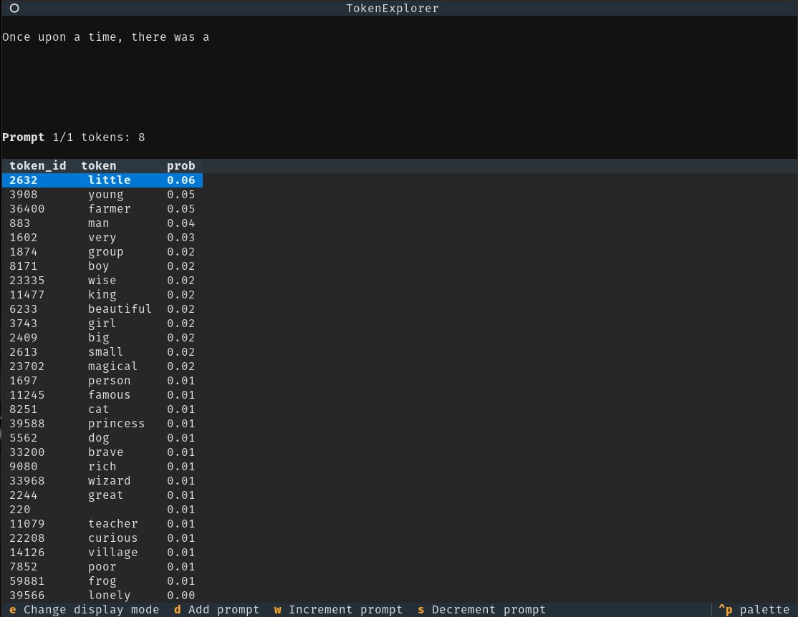

The idea of Token-Explorer is to make it very easy to explore the space of possible prompts and token generations from an LLM. To use Token-Explorer it's best to treat your keyboard like you're playing a video game: put your left hand on WASD and your right hand on the arrow keys.

### Basic Usage

Use the up and down arrow keys to navigate the table.

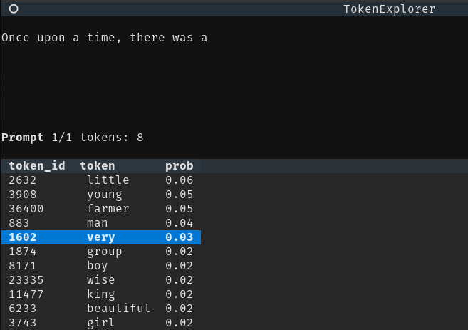

Here you can see I've highlighted the token "very" which has a probability of 0.03. Pressing the 'right' arrow key will append this token to the end of your prompt.
Then it will display the next set of tokens.

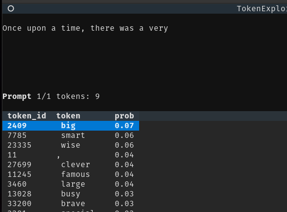

If you want to go back and reselect the token, you can use the 'left' arrow key to pop the token back off the end of the prompt.

To **quit** the app, you can press `ctrl+q`.

### Adding prompts

One of the goals of Token-Explorer is to make it easy to play around with alternate methods of prompting. To faciliate this, Token-Explorer allows you to duplicate your current prompt and add it to the list of prompts by pressing 'd'. In this image below we've added a copy of our current prompt to the list of prompts and are now at propmt 2 of 2:

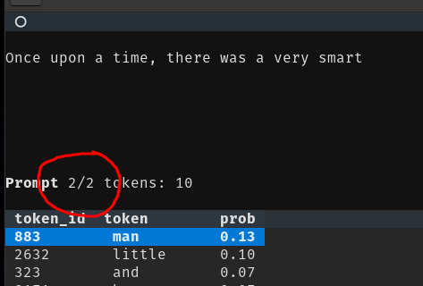

You can cycle through the prompts by pressing 'w' and 's', making it easy to try out different possible paths for your prompt, all while acting like you are the models sampler!

If you want to experiment with dramatically different prompts, you should write these out in a text file and pass them as an argument to the app.

## Visualization Layers

Token Explorer has a few different visualization layers that you can toggle on and off.

### Token Probabilities

It can be very helpful to see the probabilities of each token when generated, in part so we can see where our model might be going wrong. You can press `e` to toggle the probability view.

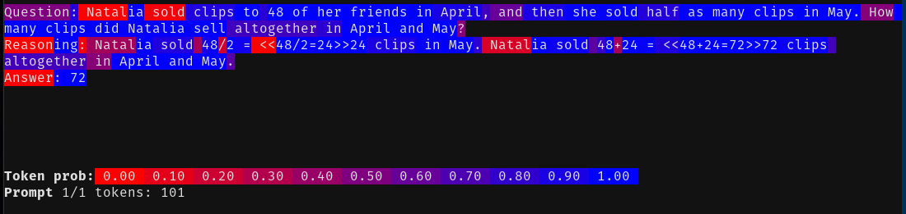

In the image above we've used the entire output of an LLM as our prompt. This allows us to understand better what the model was reasoning about when it generated the output. Notice for example that the model was basically certain the answer was 72.

### Token Entropies

Another way to understand the model's reasoning is to look at the entropy of the token distribution. Entropy represents how uncertain it is about the next token chosen. The highest (normalized) entropy is 1 (which means all tokens look like reasonable choices). The lowest is 0 (which means the model is certain about the next token).

You can simply press `e` again to enable the entropy view.

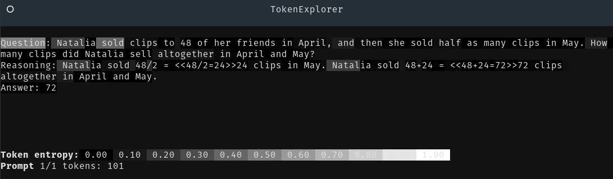

Pressing `e` again will return you back to the default view.

## Example Workflow

Let's try to understand our GSM8K prompt a bit better. The plaintext prompt is:

```
Question: Natalia sold clips to 48 of her friends in April, and then she sold half as many clips in May. How many clips did Natalia sell altogether in April and May?
Reasoning: Natalia sold 48/2 = <<48/2=24>>24 clips in May. Natalia sold 48+24 = <<48+24=72>>72 clips altogether in April and May.
Answer: 72
```

First let's understand the model's answer. We'll start by loading the prompt into Token Explorer, and then backup using the `left` arrow key until we get to the answer token.

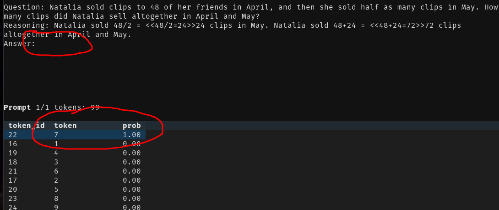

Here we can see that the model was basically certain about the answer, which makes sense given that the prompt is a simple arithmetic problem. As we can see, the model assigns a probability of essentially 1 to the answer starting with '7'. Recall that we could also see this visually be looking at the 'probabilities' layer.

It looks like our model is doing great, but let's go back to the entropy layer to see if we can find places to explore. Notice that the token 'Natalia' has higher entropy than the other tokens, which means the model is more uncertain about which token to choose next.

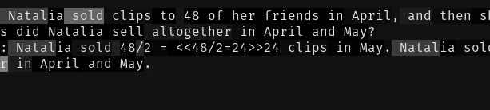

I'm curious what's happening there. I want to back up, but at the same time, don't want to lose my place in the prompt. I can use the `d` copy my prompt as a new prompt.

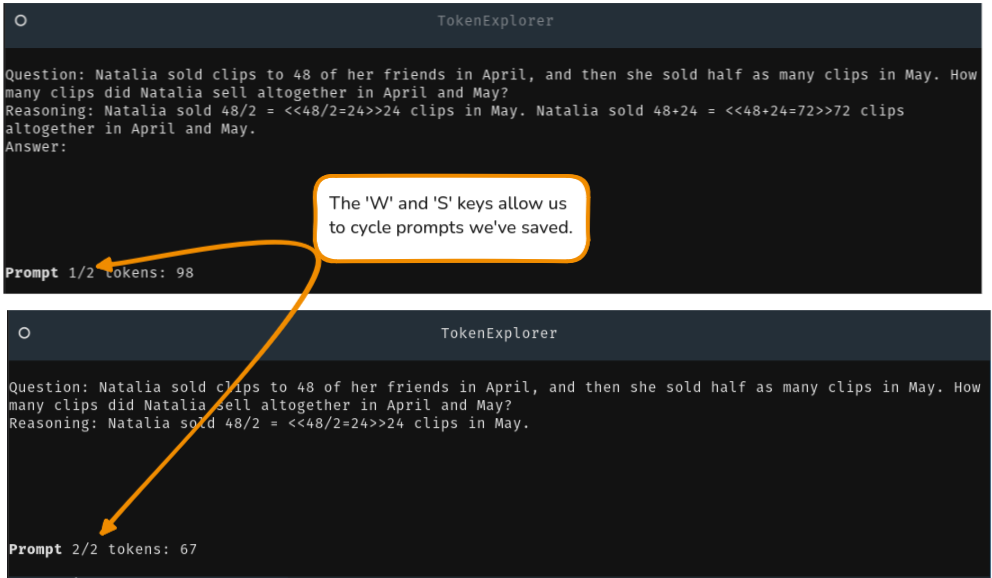

Now I can rewind until the token 'Natalia' and see if we can understand what's happening there, while still preserving my place in the prompt.

When we look at the probabilities for the next token, we can see that the model is confused between a range of choices.

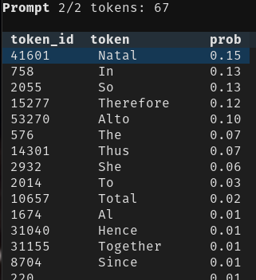

I'm curious if this part was important for our getting the correct answer. To explore we'll:

- Create a copy of this point in the prompt with 'd'
- use 'right' arrow to fill until the end.

Here's the probability view for the new prompt:

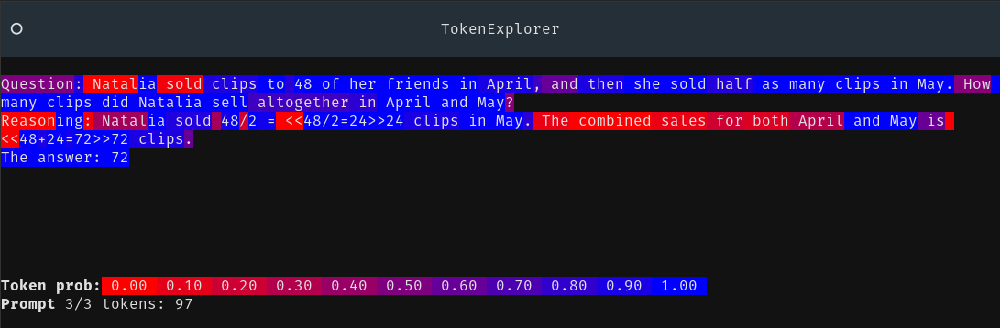

You can see both that we *did* still get the correct answer, and that the path I chose was fairly low probability for a bit. So we've learned something interesting! Even if we perturb the prompt to a low-probability path in the middle of it's reasoning, we still get the correct answer!

## Configuration

The configuration is done in the `config.toml` file. The only thing you might want to change is the `model` section, which defaults to `Qwen/Qwen2.5-0.5B`. However Token-Explorer is *far* from optimized for performance, so it's best to use a smaller model for now.